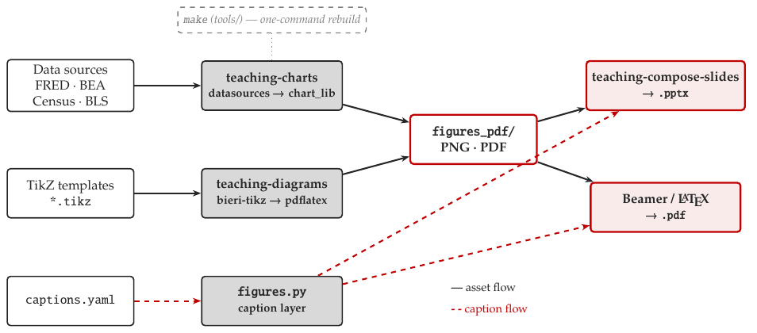

# Teaching Figures — User Guide

A single system for **theory diagrams** and **empirical charts** that renders the same
assets into both **pptx decks** and **Beamer/LaTeX** documents, in one house style
(Palatino body + math, Helvetica/Heros headers, AER conventions).



*Asset flow (black): sources → producers → `figures_pdf/` → targets. Caption flow (red):
`captions.yaml` → `figures.py` → both targets. `make` rebuilds everything.*

## The three skills

| Skill | Role | Key resources |
|---|---|---|
| **teaching-diagrams** | Theory diagrams (schematic, no data) as TikZ | `bieri-tikz.sty`, `templates/*.tikz`, `_standalone.tex` |
| **teaching-charts** | Empirical charts/tables from data; **hosts the shared caption/standards layer** | `chart_lib.py`, `datasources.py`, `series_registry.yaml`, `figures.py`, `captions.yaml`, `house-style.md`, `bieri-preamble.tex`, `bieri.mplstyle` |
| **teaching-compose-slides** | Assembles decks; embeds figures with `figureSlide` | `slide_lib.js`, `diagram_lib.js` |

The split mirrors the pedagogy: `· <concept>` theory diagrams vs. `· In the data …`
empirical charts (vs. `· In the (macro-)news …` news hooks).

## Two output targets, one source

- **pptx** — diagrams compile to cropped **PNG**; `figureSlide(p, tag, key, png, …)` embeds
  one and pulls its title/source from `captions.json` (built from `captions.yaml`). Charts
  render to PNG (`target="png"`). The slide carries the caption (`caption_mode="off"`).
- **Beamer / LaTeX** — diagrams `\input` natively (true vector); charts embed as **PDF**
  (`target="pdf"`, or `"pgf"` to render text through LaTeX so the chart font matches the
  document). Captions become real `\caption{}`+`\label{}` via `figures.latex_figure` /
  `latex_table` (`caption_mode="host"`).

## The caption toggle

Captions live **once** in `captions.yaml` (`short`, `caption`, `source`, `kind`). The mode
decides how each target realizes them:

- `off` — image only; the slide/`\caption` carries the text (deck default)
- `host` — emit a LaTeX figure/table float with numbering + `\ref`
- `baked` — draw the caption into the chart image (standalone use)

Covers figures **and** tables (`latex_table` emits booktabs from a DataFrame).

## Data pipeline

`datasources.py` pulls FRED/BEA/Census/BLS into tidy `date|value|series_id|label|source`
frames; `series_registry.yaml` maps friendly names (`from_registry("housing_starts")`).
Pulls are **cache-first** (`data/cache/*.csv`, committed) so rebuilds are deterministic and
run offline; `refresh=True` re-pulls. Keys via env vars (`FRED_API_KEY`, …) — never committed.
The provenance string auto-fills the chart's source line.

## Build

From the figures workspace (the `Makefile` lives in `tools/`):

```
make            # diagrams + charts + captions.json
make diagrams   # every templates/*.tikz -> figures_pdf/*.pdf (+ PNG preview)
make charts     # build_charts.py + dump captions.json
make clean
```

## Adding a figure

- **Diagram:** copy the nearest `templates/*.tikz`, keep only the `tikzpicture`, use
  `\bieriaxes` + named styles (never hard-code colors). Add a `captions.yaml` entry.
- **Chart:** add a series to `series_registry.yaml` (or pass a frame), call a `chart_lib`
  function with `target`/`caption_mode`. Add a `captions.yaml` entry.
- **New chart type:** add a function to `chart_lib.py` reusing `_use_target`/`_finish`.

## Conventions (AER — see `house-style.md`)

Palatino body+math, Heros headers; vector figures; booktabs tables (no vlines/shading,
≤9 cols, **leading-zero decimals**, **SEs in parentheses not stars**, Panel A/B, source
note last); math: italic scalars, bold vectors, script sets, blackboard only for ℝ/ℤ/ℕ,
≤2 sub/superscript levels. Citations: Chicago author-date.

## File map

```
skills/teaching-diagrams/  skill.md · scripts/{bieri-tikz.sty,_standalone.tex} · templates/*.tikz
skills/teaching-charts/     skill.md · scripts/{chart_lib,datasources,figures,build_charts}.py,
                            bieri.mplstyle, series_registry.yaml, captions.yaml, bieri-preamble.tex
                            references/{house-style.md, USER_GUIDE.md, process_overview.png}
tools/Makefile              one-command rebuild
```
